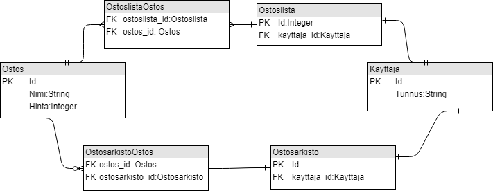

Description of database used in the probram here

# Database desctiption

## The database has 6 database tables:

### Account
A table for managing user accounts. Account has following attributes: Id, username, password, . The create table SQL-query is:

CREATE TABLE (

)

### Role
A table for managing user's roles in the application. User can have three different roles: user, admin and super. User can have multiple roles. Role has following attributes: Id and name. The create table SQL-query is:

CREATE TABLE (

)

### User_roles
User_roles is a association table between User and Role. It is a n to n relationship. It has following attributes: Id, role_id (foreign key) and account_id (foreign_key). The create table SQL-query is:

CREATE TABLE (

)

### LoginTime
A table for managing user's log in times. It has following attributes: Id, datetime, account_id (Foreign key). Logintime has n to 1 relationship with account table. The create table SQL-query is:

CREATE TABLE (

)

### Item
Item is database table for managing items. It has following attributes: Id, name, price. The create table SQL-query is:

CREATE TABLE (
    
)

### GroceryItem
GroceryItem is a association table between Item and Grocerylist. It is a n to n relationship. It has following attributes: id, grocerylist_id and item_id.
The create table SQL-query is:

CREATE TABLE (
    
)

### Grocerylist
Grocerylist is 
The create table SQL-query is:

CREATE TABLE (
    
)

### AccountGrocerylist
Account grocerylist is association table between Account and Grocerylist.
The create table SQL-query is:

CREATE TABLE (
    
)

### Archieve
Archieve is a table for collecting items to archieve. Archieve has 1:1 relationship with Account and 1:n relationship with ArchieveItem. The create table SQL-query is:

CREATE TABLE (

)

#### ArchiveItem
ArchiveItem is a association table between Archieve and Item. ArchieveItem has following attributes: Id, archive_id and item_id. The create table SQL-query is:

CREATE TABLE (

)

