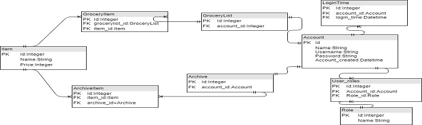

# Database desctiption

## The database has 9 database tables:

### Account
A table for managing user accounts. Account has following attributes: Id, username, password, . The create table SQL-query is:

CREATE TABLE (  
    id INTEGER NOT NULL,  
    name VARCHAR(144) NOT NULL,  
    username VARCHAR(144) NOT NULL,  
    password VARCHAR(144) NOT NULL,  
    account_created DATETIME,  
    PRIMARY KEY (id),  
    UNIQUE (username)
)

### Role
A table for managing user's roles in the application. User can have three different roles: user, admin and super. User can have multiple roles. Role has following attributes: Id and name. The create table SQL-query is:

CREATE TABLE (
    id INTEGER NOT NULL,  
    name VARCHAR,  
    PRIMARY KEY (id),  
    UNIQUE (name)
)

### User_roles
User_roles is a association table between User and Role. It is a n to n relationship. It has following attributes: Id, role_id (foreign key) and account_id (foreign_key). The create table SQL-query is:

CREATE TABLE (  
    id INTEGER NOT NULL,  
    user_id INTEGER,  
    role_id INTEGER,  
    PRIMARY KEY (id),  
    FOREIGN KEY(user_id) REFERENCES account (id),  
    FOREIGN KEY(role_id) REFERENCES role (id)
)

### LoginTime
A table for managing user's log in times. It has following attributes: Id, datetime, account_id (Foreign key). Logintime has n to 1 relationship with account table. The create table SQL-query is:

CREATE TABLE (  
    id INTEGER NOT NULL,  
    login_time DATETIME,  
    account_id INTEGER,  
    PRIMARY KEY (id),  
    FOREIGN KEY(account_id) REFERENCES account (id)
)

### Item
Item is database table for managing items. It has following attributes: Id, name, price. The create table SQL-query is:

CREATE TABLE (  
    id INTEGER NOT NULL,  
    name VARCHAR(144),  
    price FLOAT,  
    PRIMARY KEY (id)     
)

### GroceryItem
GroceryItem is a association table between Item and Grocerylist. It is a n to n relationship. It has following attributes: id, grocerylist_id and item_id.
The create table SQL-query is:

CREATE TABLE (  
    id INTEGER NOT NULL,  
    item_id INTEGER,  
    grocerylist_id INTEGER,  
    PRIMARY KEY (id),  
    FOREIGN KEY(item_id) REFERENCES item (id),  
    FOREIGN KEY(grocerylist_id)  REFERENCES grocerylist (id)
)

### Grocerylist
Grocerylist is table for storing items indivual user has added to his/her grocerylist. It has 1 to 1 relationship with Account table. It has following attributes: id and account_id.
The create table SQL-query is:

CREATE TABLE (  
    id INTEGER NOT NULL,  
    account_id INTEGER,  
    PRIMARY KEY (id),  
    FOREIGN KEY(account_id) REFERENCES account (id)
)

### Archieve
Archieve is a table for collecting items to archieve. Archieve has 1:1 relationship with Account. It has following attributes: Id and account_id. The create table SQL-query is:

CREATE TABLE (
    id INTEGER NOT NULL,   
    account_id INTEGER,  
    PRIMARY KEY (id),  
    FOREIGN KEY(account_id) REFERENCES account (id)
)

#### ArchiveItem
ArchiveItem is a association table between Archieve and Item. It is a n to n relationship. ArchieveItem has following attributes: Id, archive_id and item_id. The create table SQL-query is:

CREATE TABLE (  
    id INTEGER NOT NULL,  
    item_id INTEGER,  
    archive_id INTEGER,  
    date_bought DATE,  
    PRIMARY KEY (id),  
    FOREIGN KEY(item_id) REFERENCES item (id),  
    FOREIGN KEY(archive_id) REFERENCES archive (id)
)

